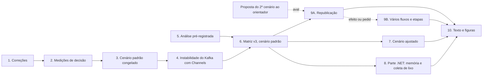

# Plano de desenvolvimento

24/09/2026. Sequência de trabalho daqui até o texto final, em ordem de dependência e sem datas. Substitui a sequência A–I do PLANO §5, concluída na primeira matriz. O estado de cada item fica no [ESTADO.md](ESTADO.md).

**Onde estamos:** na fase 1. Cada fase termina num commit e, quando mede algo, num registro em [IMPLEMENTACAO.md](IMPLEMENTACAO.md).

A fase 5 e a proposta ao orientador não dependem de nada e andam em paralelo às fases 1 a 4.

## Decisões fixadas antes de medir (24/09)

| Tema | Decisão |
| --- | --- |
| Ponto de saturação | A maior carga em que a combinação entrega pelo menos 99% das mensagens oferecidas e o P99 fica abaixo de 50 ms |
| Descarte de discrepantes | Regra de Tukey sobre o P99, dentro de cada combinação de broker, modo e carga: fora de [Q1 − 1,5·IQR, Q3 + 1,5·IQR] sai. Aplicada depois dos critérios de validade (atraso de envio e conferência). Descartes publicados por combinação |
| Repetições | 10 por combinação, em ordem sorteada dentro de cada broker |
| Cargas | Kafka em 10, 20, 40, 60, 100, 200 e 300 mil ev/s; RabbitMQ em 10, 20, 40 e 60 mil |
| Segundo cenário | Proposto ao orientador agora; construído só depois do aval, em dois passos: republicação sobre a carga atual e, depois, vários fluxos com processamento em etapas |
| Republicação | No mesmo tipo de broker (Kafka para Kafka, RabbitMQ para RabbitMQ), com at-least-once de ponta a ponta: a entrada só é confirmada depois da saída. Sem transações do Kafka |

## Fase 1. Correções

Código e configuração. Nenhuma medição.

| # | Tarefa | Arquivos |
| --- | --- | --- |
| 1.1 | Nagle no padrão da biblioteca: a opção passa a ser opcional e só é atribuída quando pedida | `KafkaSink.cs`, `KafkaEventSource.cs`, `Program.cs` do produtor e do consumidor |
| 1.2 | Limite de memória do RabbitMQ sobre os 3 GB do container (`total_memory_available_override_value`) e comentário corrigido | `infra/rabbitmq/rabbitmq.conf` |
| 1.3 | Imagem do RabbitMQ fixada em `4.3.6-management-alpine` | `infra/docker-compose.yml` |
| 1.4 | Voltar ao padrão: `batch.size`, `fetch.wait.max.ms`, `compression.type` do broker, `disk_free_limit` e heap da JVM | sinks, fontes, compose, `rabbitmq.conf` |
| 1.5 | Perfis de configuração: opção `-Profile padrao` ou `-Profile ajustado` no roteiro. Os valores de cada perfil ficam num só lugar e vão para o CSV da rodada | `Pitwall.Runner.psm1`, `run-matrix.ps1`, `sweep.ps1` |
| 1.6 | Espera síncrona na contrapressão (REVISAO §2.3): `Submit` devolve `ValueTask` e as fontes aguardam. Precisa vir antes da medição do `prefetch`, porque o `prefetch` sem limite passa a encher a fila interna | `IProcessingPipeline.cs`, os três pipelines, as duas fontes |
| 1.7 | Registro incompleto no Pipe (REVISAO §2.4): contar e invalidar a rodada, em vez de descartar em silêncio | `PipelinesPipeline.cs` |
| 1.8 | Registrar por rodada a configuração efetiva dos clientes e as variáveis `DOTNET_*` | relatórios do produtor e do consumidor, `load-results.ps1` |

**Pronto quando:**
- os testes passam, com testes novos para 1.6 e 1.7;
- uma rodada curta de cada broker termina válida;
- o log do RabbitMQ mostra o limite de memória perto de 1.843 MiB;
- o CSV traz o perfil e a configuração efetiva.

## Fase 2. Medições de decisão

Pequenas, com 3 rodadas por lado, intercaladas e com o modo Direct. A regra de decisão de cada uma está escrita antes de medir. Cerca de 1 hora e meia de máquina, sem uso do computador.

| # | Comparação | Carga | Regra de decisão |
| --- | --- | --- | --- |
| 2.1 | Kafka com e sem Nagle | 20 mil e 100 mil | O perfil padrão usa o padrão da biblioteca de qualquer jeito. A medição só diz, para o texto, quanto as rodadas antigas foram afetadas |
| 2.2 | RabbitMQ com mensagem persistente e transitória | 40 mil | O padrão mantém persistente, por equivalência de garantia. Se a transitória reduzir a mediana do P99 em mais de 10%, o perfil ajustado a usa |
| 2.3 | `prefetch` 300 contra sem limite | 40 mil e 60 mil | O padrão usa sem limite, a menos que invalide rodadas ou estoure a memória. Nesse caso, 300, com a justificativa no texto |
| 2.4 | Janelas do produtor: Kafka 1 milhão × 100 mil; RabbitMQ 8 mil × 100 mil | 200 mil (Kafka) e 60 mil (RabbitMQ) | O padrão usa 100 mil nos dois, a menos que invalide rodadas abaixo da saturação |

## Fase 3. Cenário padrão congelado

- Tabela final do perfil padrão em AUDITORIA-CONFIG.
- Tag `cenario-padrao-v1` no commit. A matriz só roda com código dessa tag.

## Fase 4. Instabilidade do Kafka com Channels

- **Método:** 10 rodadas a 100 mil e 10 a 200 mil, com latência por segundo, pausas de coleta de lixo e contadores do pool de threads.
- **Hipóteses, na ordem:**
  1. a espera síncrona corrigida em 1.6;
  2. pausas longas de coleta de lixo;
  3. espera ativa do pool de threads (`DOTNET_ThreadPool_UnfairSemaphoreSpinLimit`);
  4. rajadas grandes da fila local do consumidor Kafka.
- **Pronto quando:** a causa está identificada e corrigida, ou documentada como variação própria da combinação. Nesse caso, a matriz reporta a dispersão.

## Fase 5. Análise pré-registrada

Em paralelo às fases 1 a 4.
- Descarte de Tukey e critério de saturação implementados nos scripts de análise (`summarize.ps1`, `load-results.ps1`) e nos painéis.
- Resumo por combinação: mediana, desvio padrão, número de rodadas válidas e descartadas, e ponto de saturação.
- Testado com os dados da varredura a 100 Hz antes da matriz.
- Registro em `ANALISE.md`: o que será calculado e como, escrito antes de ver os dados da matriz.

## Fase 6. Matriz v3, cenário padrão

| Noite | Broker | Rodadas |
| --- | --- | --- |
| 1 | RabbitMQ | 4 cargas × 3 modos × 10 = 120, mais 20 a 3,7 Hz (Direct, 20 mil e 60 mil) |
| 2 | Kafka | 7 cargas × 3 modos × 10 = 210, mais 20 a 3,7 Hz |

Antes de cada noite: tag conferida, painéis desligados, só o broker medido no ar e máquina sem uso.

## Fase 7. Cenário ajustado

- Perfil `ajustado` com a recomendação de cada fornecedor e o que as fases 2 e 6 indicarem.
- Candidatos: `prefetch` e tipo de mensagem no RabbitMQ; `linger.ms` e `batch.size` no Kafka.
- Mesma matriz, com o mesmo protocolo. Se o tempo de máquina apertar, cortar cargas, não repetições.

## Fase 8. Parte .NET: memória e coleta de lixo

- Com os dados da matriz, que já registra alocações e coletas de lixo por rodada:
  - CPU, memória, bytes alocados e coletas por evento, por modo;
  - o custo de cada mecanismo interno em relação ao Direct.
- É a resposta ao "o que se ganha?" do orientador no cenário atual.

## Fase 9. Segundo cenário: vários fluxos, etapas e republicação

Só depois do aval do orientador. Desenho, dados, hipóteses (H5a a H5d) e referências em APROFUNDAMENTO §8. Construído em dois passos: o A testa a ideia central com pouco código, e o B só começa se o A mostrar efeito ou se o orientador pedir o cenário completo.

### Passo A. Republicação sobre a carga atual

A mesma telemetria de hoje, com o consumidor publicando o resultado num segundo tópico do mesmo broker e um consumidor final medindo de ponta a ponta. Testa H5a e H5b sem a complexidade dos vários fluxos.

| # | Etapa | Pronto quando |
| --- | --- | --- |
| 9.1 | Tópico e filas de saída nos dois brokers, com o mesmo número de faixas | o roteiro recria entrada e saída a cada rodada |
| 9.2 | Formato da saída carregando o horário de envio original | teste de ida e volta do codec |
| 9.3 | Republicação no Direct: publica o lote, espera a confirmação, confirma a entrada | teste com broker de mentira que confirma com atraso |
| 9.4 | Rastreador de confirmações: libera a entrada pelo maior offset contíguo confirmado (Kafka) e pela etiqueta de entrega (RabbitMQ) | teste com confirmações fora de ordem |
| 9.5 | Republicação no Channels e no Pipelines, em etapas ligadas por filas com limite | nenhuma entrada confirmada antes da saída, em teste |
| 9.6 | Consumidor final, o "painel": latência de ponta a ponta e conferência da saída | a conferência bate nas seis combinações |
| 9.7 | Saída resumida e saída enriquecida (1 para 1) como opção do roteiro | as duas rodam nos dois brokers |
| 9.8 | Núcleos: onde fica o consumidor final; CPU medida | o consumidor final abaixo de 50% do núcleo em que ficar |
| 9.9 | Varredura de saturação e medição de decisão: os três modos, as duas saídas, 3 rodadas | H5a e H5b confirmadas ou refutadas, registrado em IMPLEMENTACAO |

**Portão:** se Channels e Pipelines não mostrarem diferença nem com a saída enriquecida, o passo B só entra se o orientador pedir. O passo A já basta para a resposta sobre a parte .NET.

### Passo B. Vários fluxos e processamento em etapas

| # | Etapa | Pronto quando |
| --- | --- | --- |
| 9.10 | Baixar `intervals`, `weather`, `race_control`, `pit` e `stints` das 9 corridas | manifesto de cada corrida com as contagens |
| 9.11 | Codec com tipo e tamanho no cabeçalho, para mensagens de tamanhos diferentes | testes de ida e volta por tipo |
| 9.12 | Gerador de vários tópicos: telemetria a 100 Hz, posição a 3,7 Hz, fluxos leves no horário original, réplicas da frota com os fluxos do carro de origem | contagem por tipo igual à do conjunto de dados |
| 9.13 | Roteamento: um tópico por tipo no Kafka, co-particionados; exchange *topic* no RabbitMQ com chave `tipo.faixa` | o mesmo trabalhador recebe telemetria e posição do mesmo carro |
| 9.14 | Etapas de processamento: estado por carro e global, trecho da pista, detecções, janelas | testes por etapa |
| 9.15 | Tempo do evento: marca d'água por faixa, espera medida à parte | o resultado não muda com a ordem de chegada entre tópicos, em teste |
| 9.16 | Referência fora de linha e conferência | as seis combinações batem com a referência |
| 9.17 | Varredura de saturação do cenário B | pontos de saturação por combinação |
| 9.18 | Matriz do cenário B: dimensionada pela varredura, com teto de duas noites | resultados em RESULTADOS |

## Fase 10. Texto e figuras

- Nova Figura 1 no formato do TCC1 (mapa da arquitetura, layout C) e objetivos específicos atualizados.
- Tabela de configuração dos dois perfis, das ameaças à validade e dos descartes.
- Resultados: curvas de latência por carga, pontos de saturação, custo dos mecanismos e, se houver, o segundo cenário.
- Pendências do documento do TCC1 (PLANO §6).
